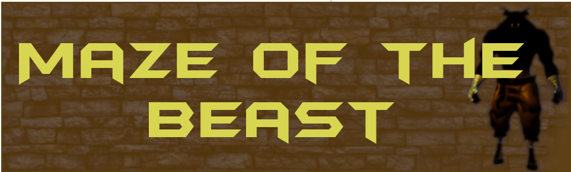
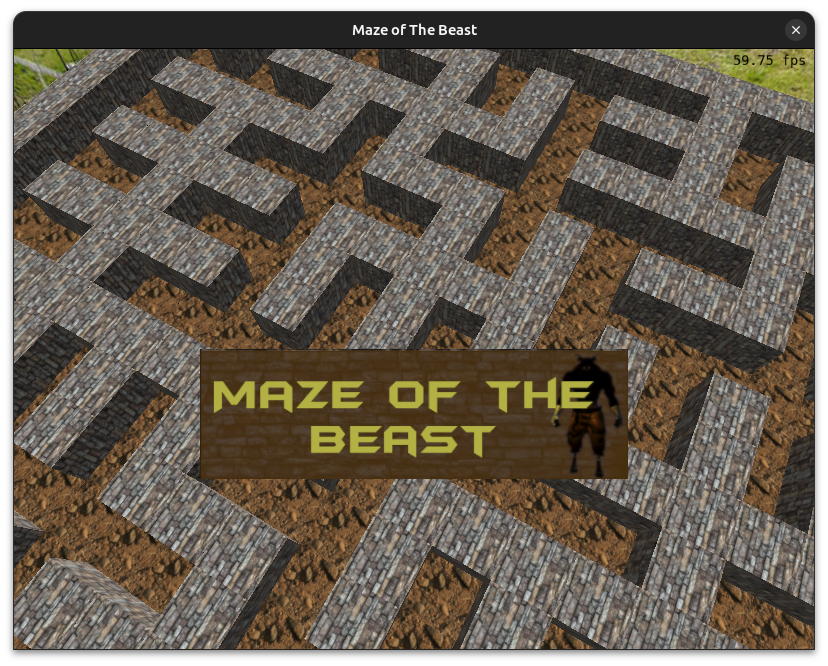
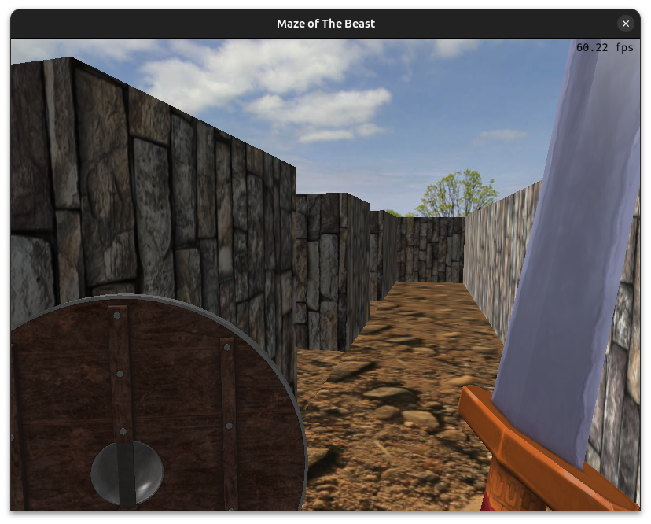
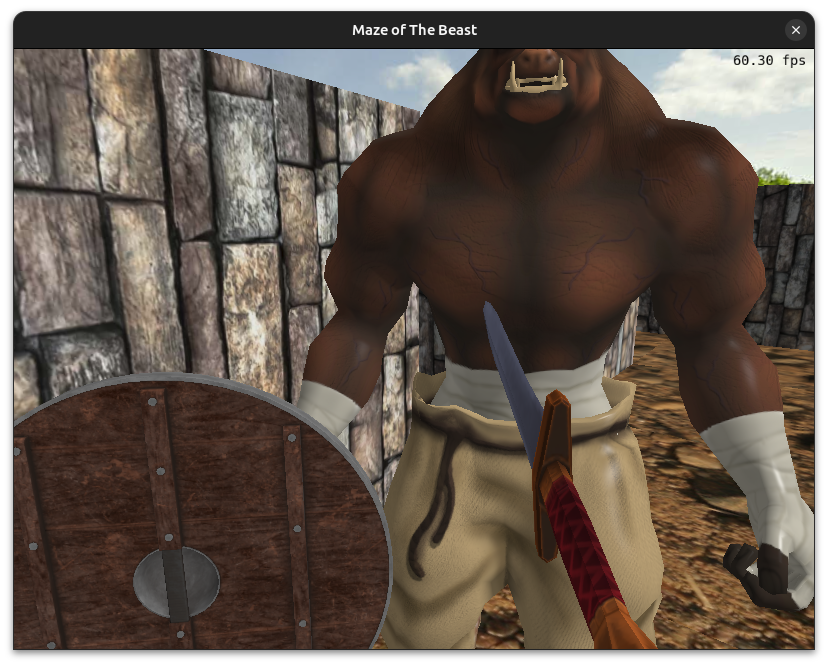
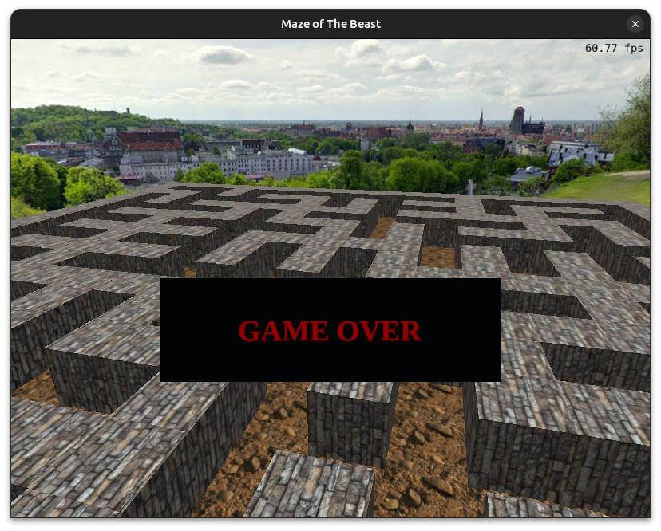
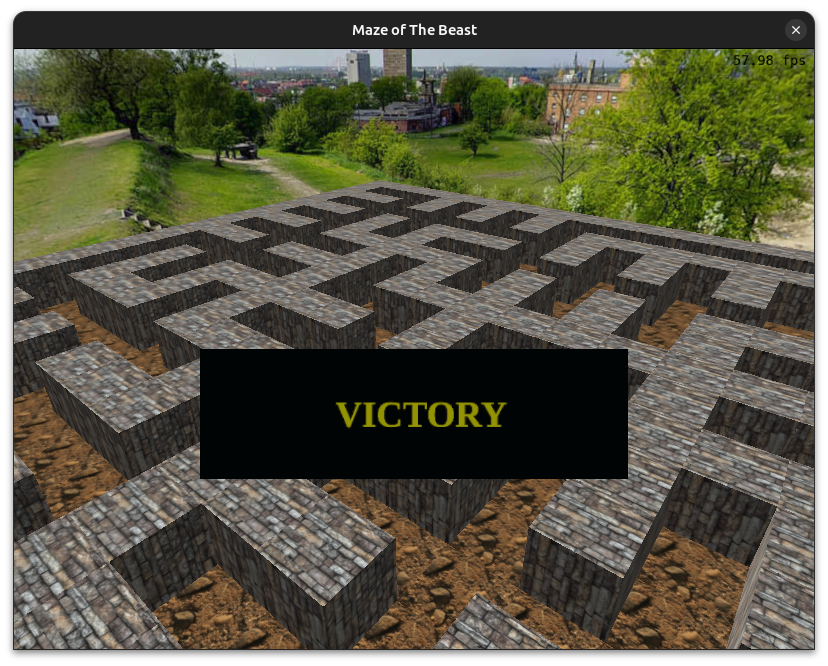

# Maze of The Beast



Assuma o papel de Teseu e entre no labirinto de Dédalo para matar a terrível besta que lá está encarcerada.

Este trabalho foi desenvolvido para a cadeira de Fundamentos de Computação Gráfica - 2023/2.


## Tecnologias e Bibliotecas Utilizadas
- OpenGL
- glm
- glad
- glfw
- tomlplusplus
- miniaudio


## Estrutura do Projeto

A seguir apresentamos as principais classes do projeto e suas responsabilidades:

- **Engine:** Classe que gerencia a execução da aplicação. É responsável por desenhar na tela a cena ativa e por gerenciar os inputs do usuário. A Engine também faz o controle das diferenças de tempo entre frames, garantindo que as animações e interações ocorram na mesma velocidade independentemente do processador. 

- **VirtualScene**: A classe VirtualScene representa uma cena do jogo, possuindo uma câmera e um conjunto de GameObjects que compõem a cena. Permite que os objetos da cena acessem os demais objetos que estão na mesma cena. Essa classe básica é especializada pelas classes de cenas específicas, que são a MenuScene e a GameScene.
    - **MenuScene:** Cena que gerencia os menus e telas de encerramento do jogo
    - **GameScene:** Cena que gerencia o jogo em si

- **GameObject:** Classe abstrata que representa um objeto genérico dentro do jogo. Contém uma referência para a VirtualScene e tem dois métodos abstratos que são sobrescritos pelos GameObjects concretos: Render() e Update(float dt).
    - **Theseus:** GameObject que representa o jogador em primeira pessoa. Controla a movimentação da câmera livre e implementa o combate.
    - **Minotaur:** GameObject que representa o minotauro. Controla a movimentação do inimigo pelo labirinto usando um algoritmo simples de path-finding. Implementa animações para movimentação e para receber dano
    - **Maze:** Labirinto gerado de forma procedural usando uma DFS randomizada. Controla as posições das paredes e do chão, limitando a movimentação do Minotauro e do Jogador.
    - **SkyBox:** SkyBox simples, utilizando projeção esférica.

- **collisions:** Implementa os testes de colisão abaixo:
    - Esfera x Cubo: utilizada para evitar que o Teseu entre nas paredes do labirinto
    - Esfera x Cápsula: utilizada para testar as interações entre o Minotauro e o Teseu
    - Cilindro x Ponto: utilizada para verificar se a espada atingiu o Minotauro

- **TextureLoader:** Carrega e gerencia as texturas da aplicação. As texturas são lidas do arquivo de configuração `settings.toml`.

- **SoundPlayer:** Carrega e gerencia a execução dos arquivos de áudio da aplicação.

## Contribuições para o trabalho

- **Diego Cardoso Nunes:** Setup inicial do projeto; Carregamento e mapeamento de texturas; Implementação dos shaders, com os modelos de iluminação de Blinn-Phong e Diffusa, e os modelo de interpolação de Gouraud e de Phong; SkyBox; Movimentação com Curva de Bézier cúbica; Animações de ataque da espada e de defesa do escudo, com transformações geométricas controladas pelo usuário; colisão do ataque (Ponto x Cilindro).

- **João Paulo Vasquez Dias:** Labirinto com geração procedural, utilizando diversas instâncias de um mesmo objeto; Animações de Movimentação do Minotauro. Path-finding do Minotauro; Sistema de áudio para os diversos eventos dentro do jogo; Colisões entre o Teseu e o Labirinto (Esfera x Cubo) e o Teseu e o Minotauro (Esfera x Cápsula).

- **Ambos:** Sistema de knockback do Minotauro; Mecanismo de sliding de objetos nas paredes do labirinto.

## Uso de ferramentas e referências externas
Não utilizamos ferramentas baseadas em IA Generativa para implementar o código deste trabalho. O nome do jogo foi criado com auxílio do ChatGPT. Nesse processo, utilizamos prompts para fazer a IA gerar diversos nomes, com variados níveis de criatividade. A maior parte dos nomes não correspondia adequadamente ao propósito e aos elementos do jogo e foram considerados insatisfatórios. O melhor nome gerado foi o utilizado: "Maze of The Beast". Como uma ferramenta para impulsionar o pensamento criativo, a IA ofereceu um bom ponto de partida e motivação para o Brainstorming, entretanto ficou claro que é essencial realizar um processo de curadoria e filtragem sobre as sugestões geradas para garantir que elas fazem sentido e se adequam ao contexto do projeto.

Para a implementação de alguns testes de colisão, utilizamos as referências disponibilizadas pelo professor na página do Moodle da disciplina.

## Processo de Desenvolvimento e Requisitos
No desenvolvimento trabalhamos tanto de forma assíncrona quanto síncrona (pair programming) através de reuniões virtuais. Os conceitos de Computação Gráfica estudados e indicados nos requisitos foram utilizados nas seguintes partes da aplicação:

- **Malhas poligonais complexas**: Carregamento dos modelos, em particular o modelo do Minotauro
- **Transformações geométricas controladas pelo usuário**: Animações da espada e do escudo. A animação de movimentação do Minotauro também é calculada com base na posição do jogador.
- **Câmera livre e câmera look-at**: A câmera livre é usada durante o jogo. A câmera look-at é usada no menu e nas telas de fim de jogo.
- **Instâncias de objetos**: Construção do labirinto, na qual os mesmos modelos de parede e de chão são desenhados em posições distintas, com diferentes matrizes de modelo.
- **Três tipos de testes de intersecção**: 
    - Esfera x Cubo: utilizada para evitar que o Teseu entre nas paredes do labirinto
    - Esfera x Cápsula: utilizada para testar as interações entre o Minotauro e o Teseu
    - Cilindro x Ponto: utilizada para verificar se a espada atingiu o Minotauro
- **Modelos de Iluminação Difusa e Blinn-Phong**: Paredes e chão do labirinto usam iluminação difusa. Minotauro, espada e escudo usam iluminação de Blinn-Phong.
- **Modelos de Interpolação de Phong e Gouraud**: Paredes e chão do labirinto usam interpolação de Gouraud. Demais objetos usam interpolação de Phong.
- **Mapeamento de texturas em todos os objetos**: Todos os objetos têm texturas
- **Movimentação com curva Bézier cúbica**: Easter-egg das asas de Ícaro sobrevoando o labirinto, seguindo uma Curva de Bézier cúbica.
- **Animações baseadas no tempo ($\Delta t$)**: Animações da espada, escudo e do Minotauro.

## Imagens da aplicação










## Manual da aplicação
Na tela inicial, clique com o botão esquerdo para entrar no jogo. O personagem é movimentado com WASD e a câmera é controlada pela movimentação do mouse. Ataque com o botão esquerdo do mouse e use o escudo com o botão direito.

## Compilação e Execução da Aplicação

Nesse projeto utilizamos o padrão C++17. Para compilar e executar a aplicação, use os comandos abaixo:

```
cmake .
make
make run
```